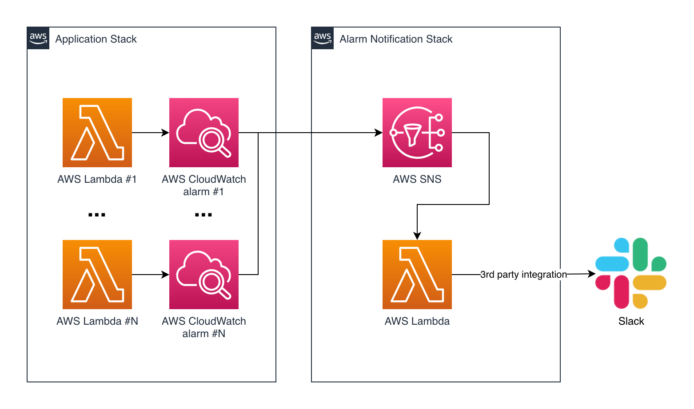

# CDK Lambda Notifier

This is a TypeScript CDK project created from the official CDK template. This is an example CDK stack that is able to receive CloudWatch alarm notifications into an SNS topic. In turn, the SNS topic invokes a Lambda function that can process the notifications. This specific example integrates into Slack using App Incoming Webhooks. Read the full article [here](https://medium.com).



## Why?

Coming from the Serverless Framework background, I was quite used to having Lambda alarms available (almost) out of the box for each Lambda  -  thanks to this [plugin](https://www.serverless.com/plugins/serverless-plugin-aws-alerts). Lambda alarms are especially useful for catching errors early, and only at the cost of $0.10 per alarm per month. However, AWS CDK is pretty bare-bones, so we will need to set this up manually.

## How to run

```bash
npm install -g aws-cdk # install CDK
npm install # install project dependencies
npm run build # compile TypeScript
npm run cdk deploy
```

Destroy the stack after you are done:

```bash
npm run cdk destroy
```
